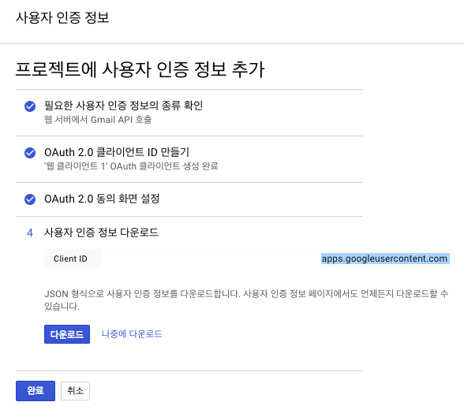
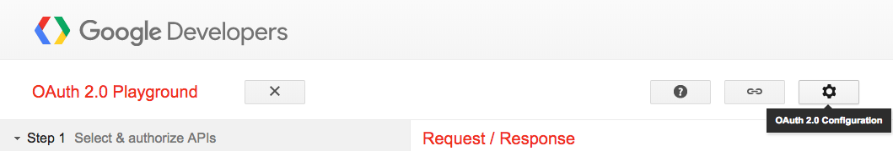
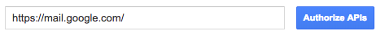
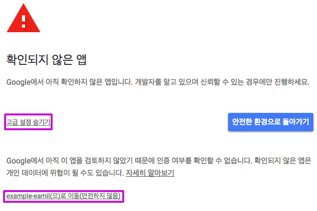
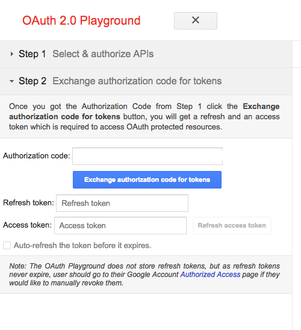
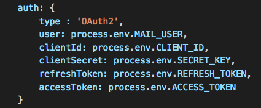

# nodemailer-smtp-and-oauth2

> https://nodemailer.com


## Install

```bash
$ https://github.com/u4bi-store/nodemailer-smtp-and-oauth2.git email
```

```bash
$ cd email
```

```bash
$ npm install
```

## Usage

```bash
USER=GMAIL ID
PASS=GAMIL PASSWORD
SECRET_KEY=SECRET KEY           -(google cloud console)
REFRESH_TOKEN=REFRESH TOKEN     -(google cloud console)
CLIENT_ID=CLIENT ID FROM        -(google cloud console)
ACCESS_TOKEN=ACCESS TOKEN FROM  -(google cloud console)
```

```bash
$ node app
```

# SMTP

#### Step1 : Change SMTP settings to check Gmail on other clients
https://support.google.com/mail/answer/7126229
- https://mail.google.com/mail/u/0/#settings/fwdandpop
  - select Enable IMAP.

#### Step2 : Less secure Apps

https://myaccount.google.com/lesssecureapps
- Enable lesssecureapps permission.

#### * Copy and Paste code
[SourceCode](https://github.com/u4bi-store/nodemailer-smtp-and-oauth2/blob/28e45cfef8731157f18c881a94daff1e2ade69df/app.js)

```bash
$ node app
```

# OAuth2

#### Step1 : Google Cloud Console
https://console.developers.google.com/projectselector/apis

#### Step2 : New Project
https://console.developers.google.com/projectcreate

#### Step3 : Search the Gmail API library
https://console.developers.google.com/apis/library
- Gmail API
- select the Enable API button.

#### Step4 : Create Client ID
`select the Create Client ID button.`
* [1] Gmail API
* [2] Web Server(exam : node.js Tomcat)
* [3] Select the Client Data
* next

`Create OAuth Client for the Project`
* [1] name : example project name
* [2] null
* [3] Redirect URI : https://developers.google.com/oauthplayground
* next

`Proejct Name`
* [1] example-email
* next

### Step5 : Download Client ID



#### * Download
  -        client_id.json
#### * Next

### Step6 : OAuth 2.0 Playground
https://developers.google.com/oauthplayground



#### Step1 : Select the OAuth 2.0 configuration
* [1] Select the Use your own OAuth credentials
* [2] OAuth Client ID
  -        client_id.json
* [3] OAuth Client secret
  -        client_id.json
* [4] Close

#### Step2 : Select the Authorize APIs button



### * Select the Authorize APIs



### * Next



### * Select the Exchange authorization code for tokens
[TIP] ✔️ Auto-refresh the token before it expires.

# 🦁 Success !

```bash
SECRET_KEY=
CLIENT_ID=
ACCESS_TOKEN=
REFRESH_TOKEN=
```

#### * Copy and Paste code
[CommitLog](https://github.com/u4bi-store/nodemailer-smtp-and-oauth2/commit/8eecba7be4e32677eee0a17ce7eca843bf8f7fe7)



```bash
$ node app
```